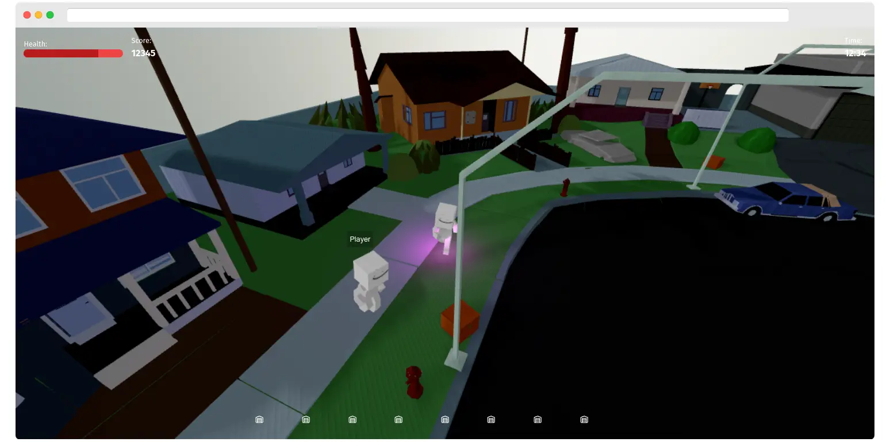
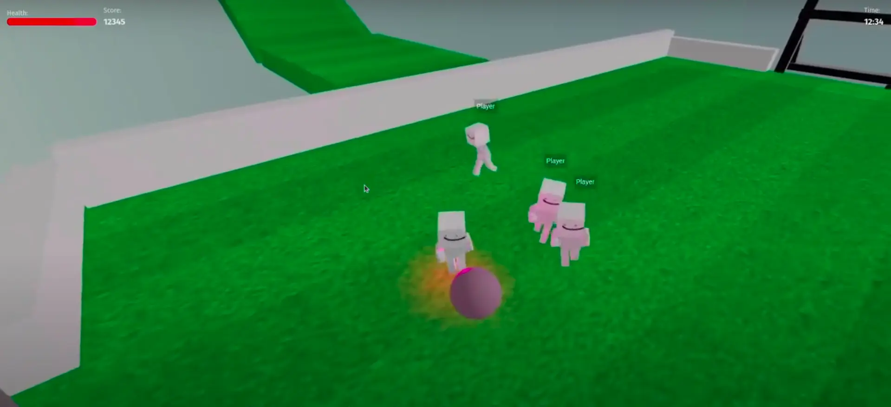
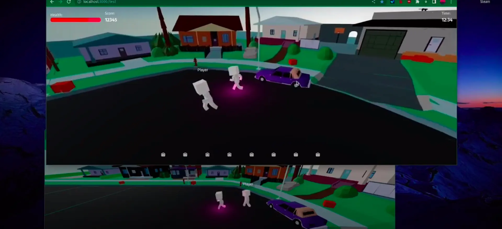

# Three JS Multiplayer Game Demo



## Features

- Multiplayer
- Only TypeScript
- 3D Physics (Rapier.js)
- Vanilla Three.js
- Server Authoritative
- ECS (Entity Component System) with Network Sync (NetworkComponent)
- Delta Compression
- Interpolation
- Fast to load (small assets)
- Shared code between server and client (useful for component replication)
- Trimesh Collider

## You like this project or want to talk about Three.js games ? 
Discord  https://discord.gg/aEBXPtFwgU 👀

## Why ?

Browser games are fun, but most of them are Unity WebGL exports that take a long time to load.
I wanted to create a simple multiplayer game engine using Three.js and my own ECS. This project has in mind to be a simple and fast game engine that can be used to create simple multiplayer games with the modularity of ECS.

### Multiplayer GTA-like ?

I'm thinking about creating a GTA-like game with this engine. It would be a simple game with a city, cars, and players. The game would be server-authoritative, and the server would be able to spawn cars, NPCs, and other entities. The game would be a simple sandbox game where players can interact with each other and the environment.
Inspiration : https://github.com/swift502/Sketchbook

## Demo (Click on the images to see the video)

[](https://www.youtube.com/watch?v=7vBifZ2qG1k "See on youtube")

[](https://www.youtube.com/watch?v=Uu3VCuyD9EA "See on youtube")

### Online demo

Small demo here : [NotBlox.online](https://www.notblox.online/)

Hosted on an european server, there is no client side prediction, so the game may be laggy if you are far from the server.

### Controls

- Z : Forward
- S : Backward
- Q : Left
- D : Right
- Space : Jump
- A : Camera Left
- E : Camera Right

## How to run

### Back-end

Modify the `back/.env` file with `NODE_ENV=development`

```bash
  cd back
  npm install
  npm run dev
```

### Front-end

Uncomment the `NEXT_PUBLIC_SERVER_URL` variable in `front/.env.local`, it will default to localhost

```bash
  cd front
  npm install
  npm run dev
```

### Shared file import Error .js files fix

[Link to GitHub Discussion](https://github.com/vercel/next.js/discussions/32237)

### Network Idea

- ZombieComponent on the back-end equipped on each player
- When assigned to a player, the player becomes a Zombie.
- Sent via the NetworkDataComponent to the players.
- Components can "sleep" to avoid being sent over the network.
- Data like ZombieComponent may be relevant only once.
- If a component sleeps, it isn't sent.
- Players need to know when a component has been removed, so a boolean or "destroyed" indicator is sent.

### Event system?

[Link to StackExchange Question](https://gamedev.stackexchange.com/questions/194133/is-it-better-design-to-store-event-effects-within-an-entity-itself-or-within-a)

### Component states

A component is "updated" when its data has been changed (e.g., `SizeComponent width += 1`). A component can be "destroyed," and then it is sent.

### My logic

- Front-end only receives the delta; it receives data when it has changed.
- For example, if a `ColorComponent` changes, it is sent to the player.
- If there is no change, it will not be sent anymore.
- Back-end needs to pass some events; this is achieved with `EventComponents` that are only called once and then removed from the Entity.
- If a player changes its `ColorComponent`, an `EventColorComponent` is fired, received by a `ColorSystem` that checks for each `EventColorComponent`, applies the logic to the `ColorComponent`, and destroys the `EventColorComponent`.

Other example:

- `EventFireComponent` <- user input
- `EventFireSystem` <- this checks for it
- `shared/FireComponent` <- contains the real data, inherited from `NetworkComponent` because it needs to be sent to the clients back.

## Asset Credits

San Andreas Map :
https://skfb.ly/oJSPS

Kenney Assets
https://www.kenney.nl/
