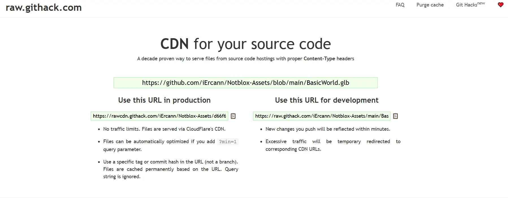

# Three JS Multiplayer Game Demo

Welcome to **Notblox**! This project showcases a simple multiplayer game engine built with Three.js and TypeScript, featuring an Entity Component System (ECS) for efficient network synchronization and utilizing Rapier.js for physics.
 
### Online Demo  

 

- **Demo link:** [NotBlox.online](https://www.notblox.online/)  
- Hosted on a European server. Note: There is  no client-side prediction, so the game may feel laggy if you're far from the server.  

#### Test World  
[Play Test World](https://www.notblox.online/play/test)  
  

#### Obby Parkour  
[Play Obby Parkour](https://www.notblox.online/play/obby)  
  

#### Football  
[Play Football](https://www.notblox.online/play/football)  
  

--- 
 
#### Videos : 
- Car https://www.youtube.com/watch?v=7eSYb6jKOV0
- Football https://www.youtube.com/watch?v=tZlNKU_buCQ 
### Controls

- W : Forward
- S : Backward
- A : Left
- D : Right
- Space : Jump
- Mouse Left click : Rotate screen
- E : Interact

## Features

- Multiplayer
- Only TypeScript
- 3D Physics (Rapier.js)
- Vanilla Three.js
- Server Authoritative
- ECS (Entity Component System) with Network Sync (NetworkComponent)
- ~Delta Compression~ (needs rework)
- Interpolation
- Fast to load (small assets)
- Run on low end devices : [My Three.JS Performance Guide](PERFORMANCE.md)
- Shared code between server and client (useful for component replication)
- Trimesh Collider
- Cars

## Why ?

Browser games are fun, but most of them are Unity WebGL exports that take a long time to load.
I wanted to create a simple multiplayer game engine using Three.js and my own ECS. This project has in mind to be a simple and fast game engine that can be used to create simple multiplayer games with the modularity of ECS.

### Multiplayer GTA-like ?

I'm thinking about creating a GTA-like game with this engine. It would be a simple game with a city, cars, and players. The game would be server-authoritative, and the server would be able to spawn cars, NPCs, and other entities. The game would be a simple sandbox game where players can interact with each other and the environment.
Inspiration : https://github.com/swift502/Sketchbook

## Demo (Click on the images to see the video)

[](https://www.youtube.com/watch?v=7vBifZ2qG1k 'See on youtube')

[](https://www.youtube.com/watch?v=Uu3VCuyD9EA 'See on youtube')

## How to run locally

### Clone the repo
```bash
git clone git@github.com:iErcann/Notblox.git
cd Notblox
```

### Back-end

```bash
  cd back
  npm install
  npm run dev
```

### Front-end

```bash
  cd front
  npm install
  npm run dev
```

Go on your browser to http://localhost:4000/play/test 

## Backend Configuration (Game Server)

The backend can be configured through environment variables in `./back/.env`:

### Local dev mode 
```bash
NODE_ENV=development 
GAME_TICKRATE=20 # Game tickrate in Hz (20Hz = 50ms)
GAME_SCRIPT=defaultScript.js # Script to run 

# Commented in dev mode : 
# FRONTEND_URL=https://www.notblox.online # Only accept connections from this URL
```

### In production
```bash
NODE_ENV=production 
GAME_TICKRATE=20 # Game tickrate in Hz (20Hz = 50ms)
GAME_SCRIPT=defaultScript.js # Script to run 

# To prevent hijacking
FRONTEND_URL=https://www.notblox.online 

# To get WSS, set your path:
SSL_KEY_FILE=/etc/letsencrypt/live/npm-3/privkey.pem
SSL_CERT_FILE=/etc/letsencrypt/live/npm-3/cert.pem
```

#### Game Scripts
The `GAME_SCRIPT` system allows for modular gameplay modes similar to Garry's Mod's LUA scripts:
- Scripts are loaded dynamically at runtime
- Multiple servers can run different game modes
- No rebuild required when modifying game logic, just change the `GAME_SCRIPT` variable in the `.env` file and restart
- Located in `back/src/scripts/`

#### Tickrate Configuration

The `GAME_TICKRATE` setting controls how frequently the server updates game state:

| Tickrate | Use Case | Description | Server CPU Usage |
|----------|----------|-------------|-----------------|
| 60 ticks/s | Vehicle/Physics-heavy | Smooth physics interactions, highest precision vehicle control | High |
| 40 ticks/s | Mixed Gameplay | Good physics interactions, balanced vehicle control | Medium |
| 20 ticks/s | Standard Gameplay | Good balance of responsiveness and performance | Low |

**Performance Considerations:**
- Higher tickrates = smoother gameplay but increased:
  - Server CPU usage
  - Network bandwidth
  - Client-server messages
- Choose based on your game's requirements and server capacity
- [View Stress Test (20 ticks/s)](https://www.youtube.com/watch?v=KDODRyYXBcc)

## Front end Configuration

To configure the front end, set the `NEXT_PUBLIC_SERVER_URL` environment variable in your `.env.local` file:

```bash
# Development
NEXT_PUBLIC_SERVER_URL=ws://localhost

# Production (SSL Required)
# NEXT_PUBLIC_SERVER_URL=wss://back.notblox.online
```
 
## How to change the map

Maps are **GLB/GLTF files**. The back-end approximates a **Trimesh Collider** based on the map, which is rendered on the client.

To change the map, update the URL in `back/src/scripts/defaultScript.js`:

```typescript
new MapWorld('https://notbloxo.fra1.cdn.digitaloceanspaces.com/Notblox-Assets/world/TestWorld.glb') // Change this URL to your map
```

---

### **How to Host Your Assets for Free Without a S3 Bucket**

You can host your assets for free using **GitHub** and **Githack**. Here's how:

1. Create a repository on GitHub, e.g., [Notblox-Assets](https://github.com/iErcann/Notblox-Assets).
2. Use **Githack** to serve your assets via CDN: [Setup Githack](https://gist.github.com/jcubic/a8b8c979d200ffde13cc08505f7a6436#how-to-setup-a-literally-free-cdn).



Then, update the URL in `defaultScript.js`:

```typescript
new MapWorld(
  'https://rawcdn.githack.com/iErcann/Notblox-Assets/d66f6da91bb7f025c90aa9f6eb24b99e997efa38/BasicWorld.glb'
) // Change this URL to your map
```

---

### **How to Point the Map to a Local File (For Testing)**

For local testing, place the map .glb under the `front/public/assets` folder and use:

```typescript
new MapWorld('http://localhost:4001/BasicWorld.glb')
```

Make sure to run the front-end with `npm run dev` to serve the local file.

### Blender: How to Export a Map Correctly
 
**Export with Compression**

Choose GLB/GLTF export.


- Activate compression.


## Current Event system (might change!)

[Is it better design to store event effects within an Entity itself, or within a system?](https://gamedev.stackexchange.com/questions/194133/is-it-better-design-to-store-event-effects-within-an-entity-itself-or-within-a)

> If you are using event queues anyway, you can also do them properly. With one global EventManager system which receives all events. Systems can subscribe to events they are interested in and then the EventManager will put those events into their event queues.

- `Component` can also be a `NetworkComponent`. This means it can be sent over the network to be replicated by the clients.

### Shared

```js
// Shared component between client & back
export class ColorComponent extends NetworkComponent {
  constructor(entityId: number, public color: string);
  deserialize(data: SerializedColorComponent);
  serialize(): SerializedColorComponent;
}
```

### Back

The back-end need to pass some events; This is achieved with the event components (example: `EventColorComponent`) that are only used once per ECS loop and then removed from the EventQueue entity.

```js
// Creating a color change event on the back
EventSystem.addEvent(new ColorEvent(yourEntity.id, '#FFFFFF'))
```

It can be received by any system, here `ColorEventSystem` :

The `ColorComponent` is updated:

```js
export class ColorEventSystem {
  update(entities: Entity[]) {
    const eventColors = EventSystem.getEvents(ColorEvent)

    for (const eventColor of eventColors) {
      const entity = EntityManager.getEntityById(entities, eventColor.entityId)
      if (!entity) return

      const colorComponent = entity.getComponent(ColorComponent)
      if (!colorComponent) return

      if (colorComponent && eventColor) {
        colorComponent.color = eventColor.color
        colorComponent.updated = true
      }
    }
  }
}
```

### Client (front-end)

The component is replicated by the client with the `SyncComponentsSystem.ts`, then it uses the front-end version of `SyncColorSystem` to actually change the color of the mesh, you could incorporate more checks here depending on other components

```js
export class SyncColorSystem {
  update(entities: Entity[]) {
    for (const entity of entities) {
      const colorComponent = entity.getComponent(ColorComponent)
      const meshComponent = entity.getComponent(MeshComponent)
      if (colorComponent && meshComponent && colorComponent.updated) {
        meshComponent.mesh.material = new THREE.MeshPhongMaterial({
          color: colorComponent.color,
        })
      }
    }
  }
}
```

## You like this project or want to talk about Three.js games ?

Discord https://discord.gg/aEBXPtFwgU 👀

### Shared file import Error .js files fix

[Link to GitHub Discussion](https://github.com/vercel/next.js/discussions/32237)

## Asset Credits

San Andreas Map :
https://skfb.ly/oJSPS

Kenney Assets
https://www.kenney.nl/

## ⚠️ This project is not related to any crypto project

There have been some modifications of Notblox running online to promote cryptocurrencies, it is not made by me

The point of notblox was to show a demo of a multiplayer 3d game with three.js, fully open-source

The only version I run is notblox.online, all the other modifications are made by third-parties
